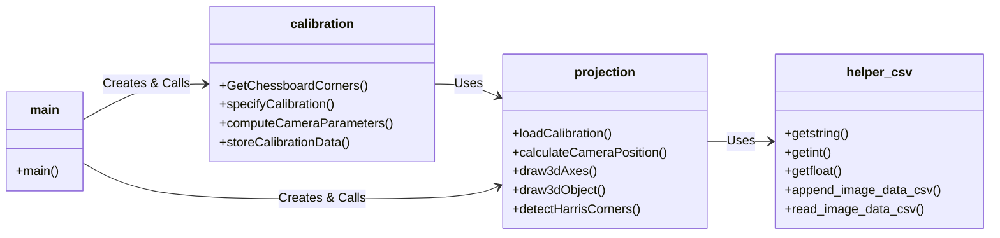
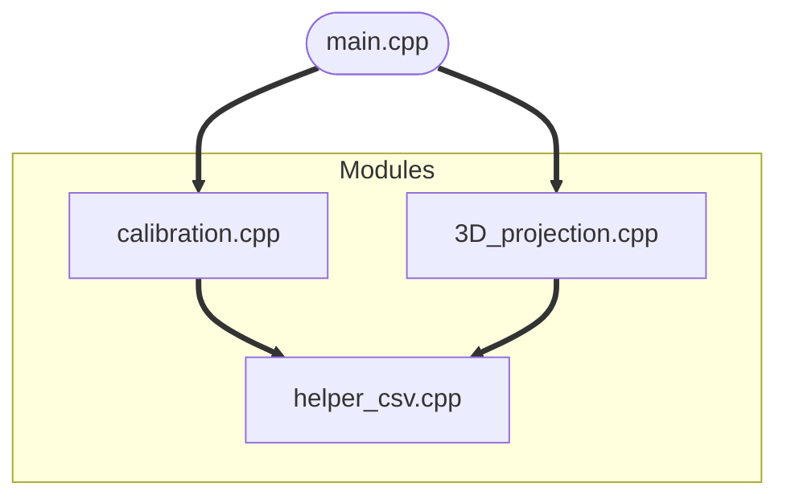
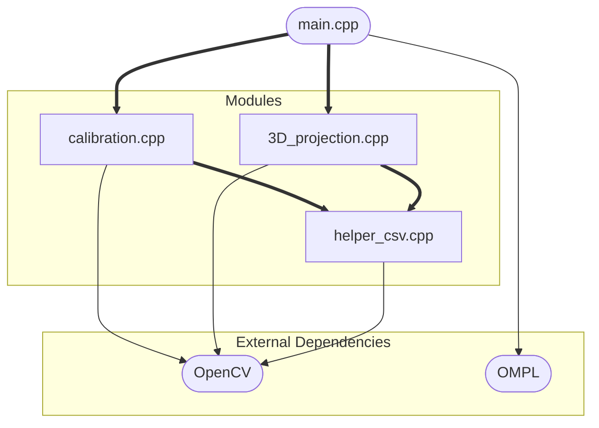

# AR-Vision Project
AR-Vision is a computer vision project that combines augmented reality (AR) with computer vision techniques to create interactive experiences. It detects and tracks real-world objects, overlaying virtual content on them in real-time. The project uses OpenCV and OpenGL libraries for image processing, feature detection, camera calibration, and projection mapping.

## Demo

https://user-images.githubusercontent.com/61319491/236359714-d5d335d3-8c89-438c-89ab-82184dcea746.mov

## Features
- Camera calibration module
- Feature detection and tracking module
- Rendering engine
- Interface to control and manipulate virtual objects
- Sample applications: virtual object placement, object recognition, and face tracking

## Getting Started
To run the project, execute the main function. The code will search for either the chessboard or circle-grid image through the camera, depending on the selected mode.

### Chessboard Mode Controls
- x: Show 3D axes
- d: Display virtual objects
- r: Show Harris corners
- s: Save the current image frame for calibration (if more than five frames are saved, continuous calibration starts automatically)
- c: Save the current calibration as a CSV file
- k: Capture a screenshot of the current video frame

# Introduction to the AR System Code

### PlantUML

### Internal Dependencies

### External dependencies

### Overview

This project is an augmented reality system that performs camera calibration and projects virtual 3D objects onto a camera view of a physical target. It uses OpenCV for computer vision tasks.

The key capabilities are:

- Camera calibration using checkerboard or circle grid
- Estimating camera pose relative to target
- Projecting 3D coordinate axes on target 
- Visualizing 3D shapes like cubes, spheres etc.
- Performing robust feature detection

### System Architecture

The code is structured into several modular components:

- `main.cpp` - Main entry point and high level orchestration
- `calibration.cpp/.h` - Camera calibration routines 
- `3D_projection.cpp/.h` - 3D point projection functions
- `helper_csv.cpp/.h` - CSV file parsing utilities

This encapsulates distinct functionality into separate modules with clear interfaces. The components are loosely coupled and can be modified independently.

### Workflow

At runtime, the high level flow is:

1. `main.cpp` initializes OpenCV capture and GUI
2. Video frames are acquired in a loop
3. For each frame:
   - Checkerboard corners extracted (`calibration` module) 
   - Camera calibrated if enough samples gathered
   - 3D point projections called to visualize axes etc. (`projection` module)
   - GUI updated with overlayed output frame

### Key Functions

#### calibration.cpp

**GetChessboardCorners()**

- Finds checkerboard corners in image
- Populates pixel coordinates of corners
- Draws corners on output image

**specifyCalibration()** 

- Computes world coordinates of corner points
- Stores pixel and world coordinates for calibration

**computeCameraParameters()**

- Performs camera calibration 
- Calculates camera matrix and distortion coeffs
- Returns reprojection error 

**storeCalibrationData()**

- Saves calibration results to CSV file

#### 3D_projection.cpp

**loadCalibration()**

- Loads camera matrix and distortion coeffs from CSV

**calculateCameraPosition()**

- Estimates camera pose relative to target
- Computes rotation and translation matrices  

**draw3dAxes()**

- Projects 3D axes to image coordinates
- Draws axes on image frame

**draw3dObject()**

- Projects 3D model vertices to image
- Draws virtual 3D object on target

#### helper_csv.cpp

**append_image_data_csv()**

- Appends image data row to CSV file

**read_image_data_csv()** 

- Parses image data CSV file
- Returns filenames and feature vectors

